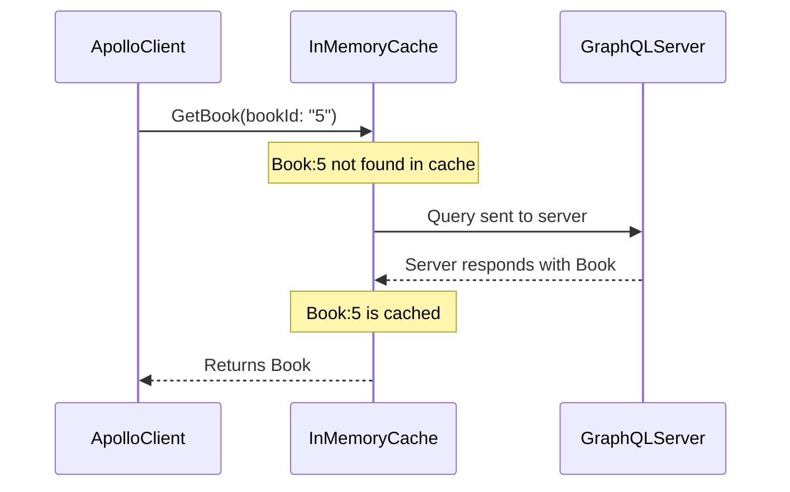
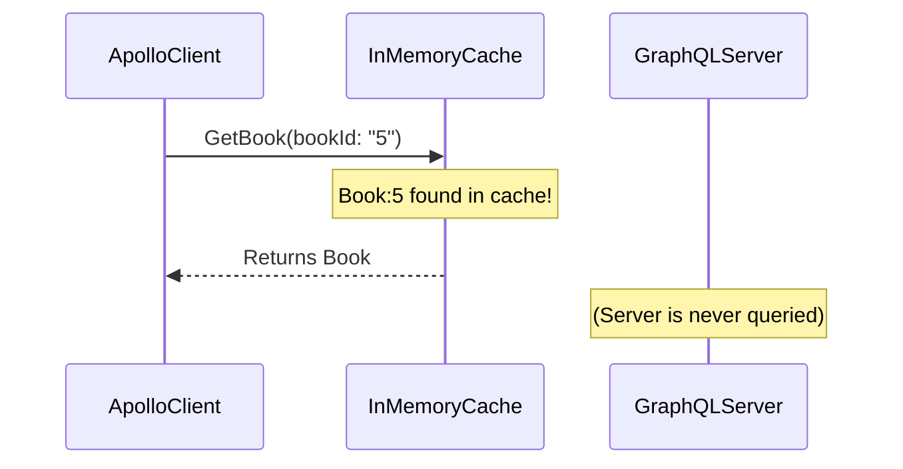

# `cache-first`

<!--
- Apollo Client isn’t just a remote data fetcher—it’s a state management tool.
- Explain how to leverage such capabilities in pointfive, for example fetch user instead of zustand `useAuth` hook
-->
